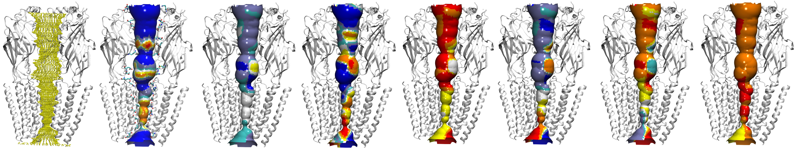

# VMDPathFinder

<p align="center">
  
</p>

<p align="center">
  <a href="LICENSE"></a>
  
  <a href="https://aminkvh.github.io/VMDPathFinder/"></a>
  <a href="https://doi.org/10.5281/zenodo.22089390"></a>
</p>

> **Formerly VMDHole.** Settings from `~/.vmdhole_config` are carried over automatically.

VMDPathFinder is a [VMD](https://www.ks.uiuc.edu/Research/vmd/) plugin for analysing
pores and molecular tunnels. **Pore mode** runs
[HOLE](https://www.holeprogram.org/) along a specified channel axis. **Tunnel
mode** searches from a buried point for routes to the molecular surface. Results
remain linked to the VMD structure and
trajectory.

[Documentation](https://aminkvh.github.io/VMDPathFinder/) ·
[Install](docs/installation.md) ·
[First analysis](docs/quickstart.md) ·
[Parameter reference](docs/parameters.md)

## What VMDPathFinder adds

<p align="center">
  
</p>

VMDPathFinder brings pore and tunnel analysis into one trajectory-aware VMD workflow. Instead of treating structures, pathways, hydration, and visualization as separate tasks, it keeps them linked to the same molecule and simulation frame.

* **Pores and tunnels in one place.** Analyze channel pores or routes from buried sites to the surface, then measure their geometry, bottlenecks, lining residues, and physicochemical properties.

* **More than a single pore radius.** Choose spherical, Connolly, or capsule pore models for round, irregular, or slit-like channels. Track and annotate [Connolly lateral openings](docs/pore-mode.md#inspect-connolly-lateral-openings), or rank and follow tunnel routes across a trajectory.

* **Structure linked to dynamics.** Examine how geometry, hydration, free energy, and ion movement change frame by frame through synchronized plots and live 3D views.

* **Built for trajectories.** Parallel frame processing and compiled acceleration make large ensemble analyses practical while retaining interactive visualization in VMD.

* **Results ready to use.** Export pathway properties, plots, and figures for further analysis, publication, or reproducible workflows.

## What is new

* **Compare several pores side by side.** Run an analysis, press **+**, run
  another, and both stay on screen in their own colours. Each run keeps its own
  settings, results, and a separate run folder. Up to ten pore analyses can be
  held in Memory.

* **Display slit-shaped pores.** Capsule surfaces join the slices' stadium-shaped
  outlines to show elongated cross-sections and narrow gates.

* **Track individual side openings.** Connolly annotations estimate each
  opening's neck radius and track its occurrence. Openings below the **Seen**
  threshold remain visible in grey.

* **Inspect ions and water in each opening.** **Ion & Water > Openings** reports
  occupancy, visit lengths, and ion species. These are not full permeation counts.

See [Performance](docs/performance.md) for measured timings and comparisons.

## Performance

Measured on an 8-core AMD Ryzen 7 7700X. Trajectory comparisons use 15
VMDPathFinder workers against serial baselines. Results depend on the system,
settings, and hardware; repetition counts and build details are recorded with
each benchmark.

| What | Compared with | Speedup |
|---|---|---|
| Surface triangulation (`sos_triangle`), same surface, byte-identical output | HOLE 2 `sos_triangle` | 3.4x at dot density 10, 73x at density 40 |
| HOLE pipeline on one structure (1BL8): search, dots, surface | HOLE 2 binaries built at -O2 | 5.3x circular, 7.1x Connolly |
| 50-frame trajectory, radius profiles | mdahole2 | 93x |
| 50-frame trajectory, radius profiles | serial HOLE shell loop | 6.1x |
| 50-frame trajectory, surface generation | mdahole2 | 50x |
| 50-frame trajectory, surface generation | serial HOLE shell loop | 16x |
| Job pool, 15 workers on 8 cores | 1 worker | 6.4x |
| Pore search step only, Nelder-Mead (18,677 atoms) | HOLE's Monte Carlo search | 5x |
| Tunnel search (MOLE 2 algorithm), matching tunnel counts | MOLE 2 | 9.7x to 16x |
| Tunnel search, compiled engine | the plugin's Tcl fallback | 173x to 231x |
| Cross-frame tunnel clustering, 1837 pathways | the plugin's Tcl fallback | 23x |

HOLE comparisons use locally rebuilt `-O2` binaries. Surface-generation timings
exclude interactive display. The Nelder-Mead 5x result measures the search
step, not a complete run; the separate 50-frame benchmark showed no overall
speedup over accelerated HOLE. Matching tunnel counts do not establish identical
route geometry; tetrahedron counts differ on some test structures.

<p align="center">
  
</p>

Provenance and the replication kit: [paper/README.md](paper/README.md).

## Install

VMDPathFinder is a Tcl plugin, but native analysis binaries are strongly recommended.
The bundled Tcl fallbacks maximize compatibility; they are much slower and are
not the recommended path for trajectories or production calculations.

### 1. Install the plugin

1. Download and extract a VMDPathFinder release, or clone this repository.
2. Add the directory containing `vmdpathfinder` to VMD's Tcl path and load the
   package from `.vmdrc`:

   ```tcl
   lappend auto_path /absolute/path/to/VMDPathFinder
   package require vmdpathfinder 1.0
   ```

3. Restart VMD and open **Extensions → Analysis → VMDPathFinder**.

### 2. Install the native binaries (highly recommended)

Use the binary bundle attached to the same VMDPathFinder release when one is
available for your operating system and CPU. For the best performance and
compatibility, rebuild the native tools locally.

Local-build requirements:

- a POSIX shell, `make`, and Python 3;
- a C compiler and a Fortran compiler with legacy Fortran support;
- OpenMP compiler support for the parallel Connolly and `sph_process`
  accelerators;
- Git and network access only when the script must download HOLE 2 for you.

From the repository, run:

```sh
./native/build-vmdpathfinder-optimized.sh
```

With no argument, the script downloads the pinned HOLE 2 source and builds into
`native/build/`. To use an existing source tree or another output
location, pass either absolute or relative paths:

```sh
./native/build-vmdpathfinder-optimized.sh /any/path/to/hole2/src /any/output/path
```

In VMDPathFinder, open **File → Settings** and select the resulting `hole`,
`sph_process`, `sos_triangle` (which also carries the marching-cubes mesher, the Nelder-Mead search and the Connolly classifier), and `mole_tunnel_engine` executables.

See the [installation guide](docs/installation.md) for platform requirements,
binary choices, verification, and upgrades.

## Minimal examples

### Pore

The distribution includes gramicidin A at
`vmdpathfinder/1GRM.pdb`.

1. Load the PDB in VMD.
2. Open VMDPathFinder and select **Pore** mode.
3. Set **Selection** to `all` and **Frames** to `now`.
4. Keep the proposed `CPOINT` and `CVECT`, or define the direction with the
   **⌖** dialog beside `CVECT` (two points, with controls to move either endpoint).
5. Enable **Show cues** under the **HOLE parameters** gear and confirm that the
   point and arrow follow the channel.
6. Select **Run HOLE**.

### Tunnel

1. Load `vmdpathfinder/1MXT.pdb` in VMD.
2. Select **Tunnel**, set **Selection** to `protein`, and set **Frames** to
   `now`.
3. Enable **Auto-detect origins (scan whole structure)**.
4. Select **Run Tunnel**.

For complete worked examples, choose a path in the
[tutorials](docs/tutorials.md).

## Scientific scope

**Pore mode** follows a specified channel axis. Spherical HOLE estimates the
largest non-overlapping probe sphere at successive positions; Connolly and
Capsule supply alternative cross-sectional models. Results depend on the atom
selection, radius file, starting point, direction, sampling interval, method,
and stochastic-search settings. Report these inputs with derived radius,
volume, or conductance values.

**Tunnel mode** answers a different geometric question: which routes connect a
buried origin to the molecular surface? Its ranked and clustered routes are
candidate pathways, not proof that a ligand, solvent molecule, or ion uses
them.

Water free energy, ion occupancy, passage, and permeation analyses depend on
the sampling and preparation of the supplied trajectory. A geometric opening
or conductance estimate is not evidence of biological permeation; support such
claims with suitable simulation or experimental data.

## Citation and notices

For every VMDPathFinder analysis, cite VMDPathFinder and VMD. Add HOLE when you
use Pore mode or HOLE-derived surface processing, and
further citations for the features you report, for example MOLE 2 for tunnel
searches, CAVER 3.0
for tunnel clustering, and CHAP for CHAP-compatible hydration analysis. Open
**Help → Guide & Citations… → Citations** in the plugin or consult
[References](docs/references.md) for the exact method-specific references.

VMDPathFinder's original plugin code is MIT-licensed. The installed folder also
contains a pure-Tcl derivative of Apache-2.0 HOLE 2 code; retain
`vmdpathfinder/LICENSE-Apache-2.0.txt` and `vmdpathfinder/NOTICE.md`. The optional
`native` derivative has its own `LICENSE` and `NOTICE`. See
[LICENSE](LICENSE), [vmdpathfinder/NOTICE.md](vmdpathfinder/NOTICE.md), and
[native/NOTICE](native/NOTICE).
