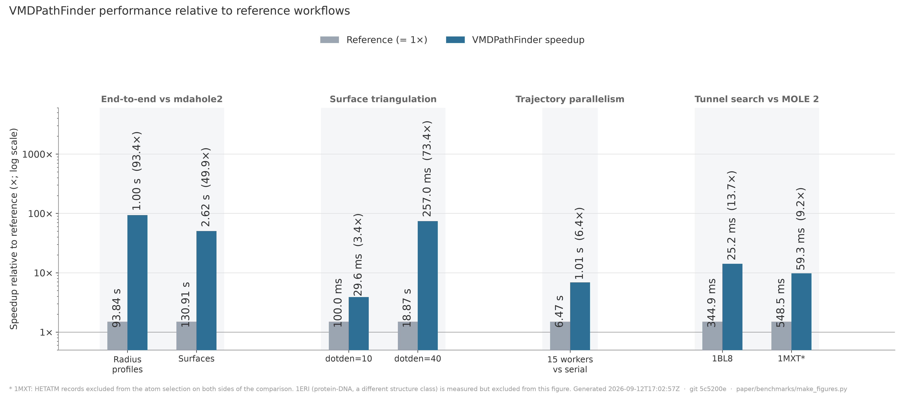

# VMDHole

<p align="center">
  
</p>

<p align="center">
  <a href="LICENSE"></a>
  
  <a href="https://aminkvh.github.io/VMDHole/"></a>
</p>

VMDHole is a [VMD](https://www.ks.uiuc.edu/Research/vmd/) plugin for analysing
pores and molecular tunnels. **Pore mode** runs
[HOLE](https://www.holeprogram.org/) along a specified channel axis. **Tunnel
mode** searches from a buried point for routes to the molecular surface. Results
remain linked to the VMD structure and
trajectory.

[Documentation](https://aminkvh.github.io/VMDHole/) ·
[Install](docs/installation.md) ·
[First analysis](docs/quickstart.md) ·
[Parameter reference](docs/parameters.md)

## What VMDHole adds

VMDHole analyzes pores and tunnels in molecular structures and trajectories directly in VMD. It is designed for large ensembles, processing frames in parallel and using compiled acceleration to make trajectory-scale analysis practical.

For pores, three modes describe different channel shapes: spherical for round channels, Connolly for irregular cross-sections and lateral openings, and capsule for narrow slit-like regions. Results include pore size, area, volume, bottlenecks, lining residues, and conductance estimates.

Tunnel mode finds routes from buried sites to the molecular surface, then ranks, clusters, and follows them across aligned trajectory frames. It reports route length, bottlenecks, occurrence, lining residues, and physicochemical properties.

VMDHole also connects geometry with chemistry and dynamics. Pores and tunnels can be annotated by properties such as hydropathy, polarity, and charge. For explicit-solvent simulations, it provides water-density and free-energy profiles, ion occupancy and flow, and bulk-to-bulk permeation measurements. Interactive plots and live 3D views help explore the results, with CSV and EPS export for further analysis and figures.

## Performance

<p align="center">
  
</p>

Full numbers, provenance and the replication kit: [paper/README.md](paper/README.md).

## Install

VMDHole is a Tcl plugin, but native analysis binaries are strongly recommended.
The bundled Tcl fallbacks maximize compatibility; they are much slower and are
not the recommended path for trajectories or production calculations.

### 1. Install the plugin

1. Download and extract a VMDHole release, or clone this repository.
2. Add the directory containing `vmdhole` to VMD's Tcl path and load the
   package from `.vmdrc`:

   ```tcl
   lappend auto_path /absolute/path/to/VMDHole
   package require vmdhole 1.0
   ```

3. Restart VMD and open **Extensions → Analysis → VMDHole**.

### 2. Install the native binaries (highly recommended)

Use the binary bundle attached to the same VMDHole release when one is
available for your operating system and CPU. For the best performance and
compatibility, rebuild the native tools locally.

Local-build requirements:

- a POSIX shell, `make`, and Python 3;
- a C compiler and a Fortran compiler with legacy Fortran support;
- OpenMP compiler support for the parallel Connolly and `sph_process`
  accelerators;
- Git and network access only when the script must download HOLE 2 for you.

From the repository, run:

```sh
./native/build-vmdhole-optimized.sh
```

With no argument, the script downloads the pinned HOLE 2 source and builds into
`native/build/`. To use an existing source tree or another output
location, pass either absolute or relative paths:

```sh
./native/build-vmdhole-optimized.sh /any/path/to/hole2/src /any/output/path
```

In VMDHole, open **File → Settings** and select the resulting `hole`,
`sph_process`, `sos_triangle`, and `mole_tunnel_engine` executables.

See the [installation guide](docs/installation.md) for platform requirements,
binary choices, verification, and upgrades.

## Minimal examples

### Pore

The distribution includes gramicidin A at
`vmdhole/1GRM.pdb`.

1. Load the PDB in VMD.
2. Open VMDHole and select **Pore** mode.
3. Set **Selection** to `all` and **Frames** to `now`.
4. Keep the proposed `CPOINT` and `CVECT`, or define the direction with
   **Vector**.
5. Enable **Show cues** under the **HOLE parameters** gear and confirm that the
   point and arrow follow the channel.
6. Select **Run HOLE**.

### Tunnel

1. Load `vmdhole/1MXT.pdb` in VMD.
2. Select **Tunnel**, set **Selection** to `protein`, and set **Frames** to
   `now`.
3. Enable **Auto-detect origins (scan whole structure)**.
4. Select **Run Tunnel**.

For complete worked examples, choose a path in the
[tutorials](docs/tutorials.md).

## Scientific scope

**Pore mode** follows a specified channel axis. Spherical HOLE estimates the
largest non-overlapping probe sphere at successive positions; Connolly and
Capsule supply alternative cross-sectional models. Results depend on the atom
selection, radius file, starting point, direction, sampling interval, method,
and stochastic-search settings. Report these inputs with derived radius,
volume, or conductance values.

**Tunnel mode** answers a different geometric question: which routes connect a
buried origin to the molecular surface? Its ranked and clustered routes are
candidate pathways, not proof that a ligand, solvent molecule, or ion uses
them.

Water free energy, ion occupancy, passage, and permeation analyses depend on
the sampling and preparation of the supplied trajectory. A geometric opening
or conductance estimate is not evidence of biological permeation; support such
claims with suitable simulation or experimental data.

## Citation and notices

For every VMDHole analysis, cite VMDHole, VMD, and HOLE. Additional citations
depend on the features used, for example MOLE 2 for tunnel searches, CAVER 3.0
for tunnel clustering, and CHAP for CHAP-compatible hydration analysis. Open
**Help → Guide & Citations… → Citations** in the plugin or consult
[References](docs/references.md) for the exact method-specific references.

VMDHole's original plugin code is MIT-licensed. The installed folder also
contains a pure-Tcl derivative of Apache-2.0 HOLE 2 code; retain
`vmdhole/LICENSE-Apache-2.0.txt` and `vmdhole/NOTICE.md`. The optional
`native` derivative has its own `LICENSE` and `NOTICE`. See
[LICENSE](LICENSE), [vmdhole/NOTICE.md](vmdhole/NOTICE.md), and
[native/NOTICE](native/NOTICE).
