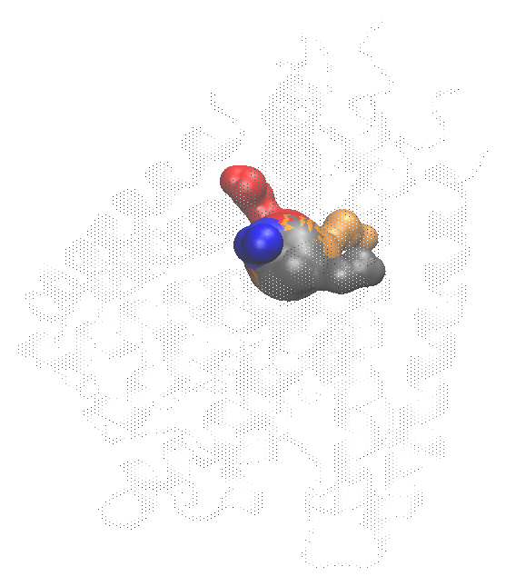
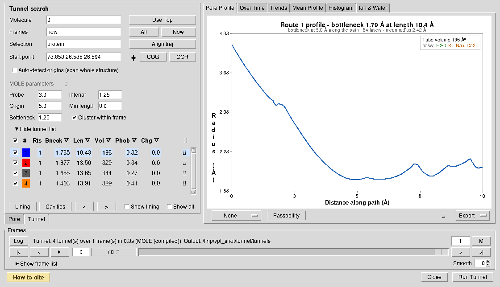

# Tunnel workflow

Tunnel mode searches for routes from a buried site to the molecular surface.
Use it for internal cavities, enzyme access paths, and branched egress routes.
Use pore mode instead when one known channel axis is the object of study.

For a publication using Tunnel mode, cite MOLE 2. If route clustering is used,
also cite CAVER 3.0; both references are listed in
[References](references.md#tunnel-analysis).

## 1. Prepare and align

Load the structure or trajectory and choose the atoms that define the molecular
interior. Make periodic structures whole before analysis. For trajectory-wide
route tracking, **Align trajectory** is on by default. Keep it enabled and
choose a stable reference selection unless the trajectory is already aligned.
It fits the loaded frames before searching. Cross-frame clustering compares
route geometry; translation or rotation of an unaligned protein is otherwise
interpreted as route motion.

## 2. Define the origin

The start point should lie in the buried cavity of interest. Enter coordinates,
use a selection's centre of geometry (**COG**) or VMD's centre of rotation
(**COR**), or enable automatic origin detection. A poor origin can return no
routes or routes from the wrong cavity. The **⌖** button opens the on-screen
stick described under pore mode, step 3, to nudge the start point relative to
the current view.

The start point also accepts a **VMD selection** instead of coordinates — its
centre is re-evaluated in every frame, so a residue-defined origin (for example
`resname HEM`) follows the trajectory rather than staying where it was in frame
0. Several origins are given as a `;` list mixing both forms
(`73.8 26.5 26.6; resid 74 and chain A`); each is pinned separately and the
routes found from all of them are merged and de-duplicated, which is MOLE's
pinned multi-origin mode.

Custom exits restrict the search toward known surface regions, and take the same
three forms — coordinates, a selection, or a `;` list of them. A custom path is
defined by start and end points. **Use custom exits only** excludes other exit
candidates; use it only when the biological exit is independently known.

## 3. Set the search criteria

The six controls shown in the main panel are sufficient for most analyses:

| Control | Default | Meaning |
|---|---:|---|
| Probe | 3.0 Å | Probe used to define accessible void space |
| Interior | 1.25 Å | Minimum interior clearance |
| Origin radius | 5.0 Å | Region around the requested start used to seed origins |
| Minimum length | 0 Å | Reject routes shorter than this value |
| Bottleneck | 1.25 Å | Minimum accepted route radius |
| Cluster within frame | on | Merge geometrically similar routes in each frame |

The remaining search, exit, clustering, and rendering controls are available
from the **⚙** next to **MOLE parameters**. They are defined in the
[parameter reference](parameters.md#tunnel-search).
Change one class of parameters at a time and retain the settings with exported
results.

## 4. Run and inspect routes

Select **Run Tunnel**. The route table reports:

| Column | Meaning |
|---|---|
| Show | Visibility |
| route/color | Tracked route identifier and display color |
| Rts | Number of route instances represented by the cluster |
| Bneck | Mean bottleneck radius |
| Len | Mean route length |
| Phob | MOLE length-weighted hydrophobicity mean |
| Chg | Mean net formal charge |
| Seen | Percentage of analysed frames containing the tracked route |

Sort by a column to inspect a different property; sorting does not alter route
identity. Expand a row for details. The row gear controls that route's
representation, color, material, and property. The global gear applies display
choices to routes without a per-route override.

Route surfaces are meshed by `mesh_csg` (Settings → Engines → Spherical
mesher), the same marching-cubes mesher the spherical pore uses, since a
route is a union of spheres along its centre line. A route coloured by a
property is meshed by `sos_triangle` instead, because the per-triangle
recolouring reads that program's own mesh records. On a four-route frame of
KcsA, meshing and drawing took 59 ms against 217 ms for `sos_triangle`.

Tunnel properties are Kyte–Doolittle, Wimley–White, Kapcha–Rossky,
Fauchère–Pliska, and the MOLE hydropathy, hydrophobicity, polarity, charge,
ionizable, logP, logD, logS, and mutability fields. See
[Properties](properties.md) for their definitions and citations.

First validate every candidate in 3D. A high-ranked route can still be an
irrelevant solvent-accessible groove, and a route that terminates incorrectly
usually indicates an origin, selection, exit, or interior-classification issue.

## 5. Cluster and track

**Cluster within frame** merges similar candidates produced in one structure.
The bottleneck-row clustering control sets its geometric cutoff.

Cross-frame clustering assigns a persistent route identity to matching routes
from aligned frames. It is controlled by maximum geometric deviation, maximum
ranks considered per frame, and the minimum **Seen** percentage. Restricting
ranks reduces cost but can hide a route that is poorly ranked in some frames.

Treat a low-Seen cluster cautiously in Mean Profile or trend plots: the average
may describe only a small subset of frames. Cross-frame identity is a geometric
classification, not proof that individual solvent molecules use the route.

## 6. Display lining residues

Select a route and open **Lining** to inspect protein residues and HET groups in
contact with it. **Show lining** creates a VMD representation; previous/next
controls step through routes. **Show all** displays the routes that remain after
the current filters.

The lining window exports the selected route's lining data. The standard plot
tabs and CSV exports operate on the selected tracked route. The exported
`tunnel_N.csv` carries per-point `FreeRadius` and `BRadius` alongside the
radius, and the lining window reports the positive and negative residue counts
next to the net charge.

## 7. Available downstream analyses

Tunnel mode supports the radius/profile, Over Time, Mean Profile, Trends,
Histogram, property, lining, and Ion & Water views. Ion & Water measures the
selected route along itself, as distance along the route and distance from
it, so a bent tunnel plots as it is. It does not provide
tunnel hydration, tunnel ellipse fitting, or pore-mode bulk-to-bulk permeation.
Water free-energy and density properties require a pore-mode hydration result.

## 8. Cavities

**Cavities** lists the pockets MOLE found in the displayed frame: type
(*Cavity*, or *Void* when nothing lines it), volume, depth in tetrahedron
layers and in Å, and the boundary and inner residue counts. **Residues** opens
a cavity's two residue sets with their MOLE properties and a ready-made VMD
selection string.

Ticking **Draw** meshes that cavity as a transparent sphere-union surface on the
same track the routes are drawn on, so a route can be seen passing through the
pocket it starts from. Cavity ids are per-frame ranks — MOLE recomputes cavities
independently in each frame — so a tick means "cavity *N* of whichever frame is
shown", unlike the routes, which are tracked across frames. The surface cavity
the tunnels exit through is not listed.

Cavities require the compiled engine; a run made with the pure-Tcl fallback has
none, and the window says so.
